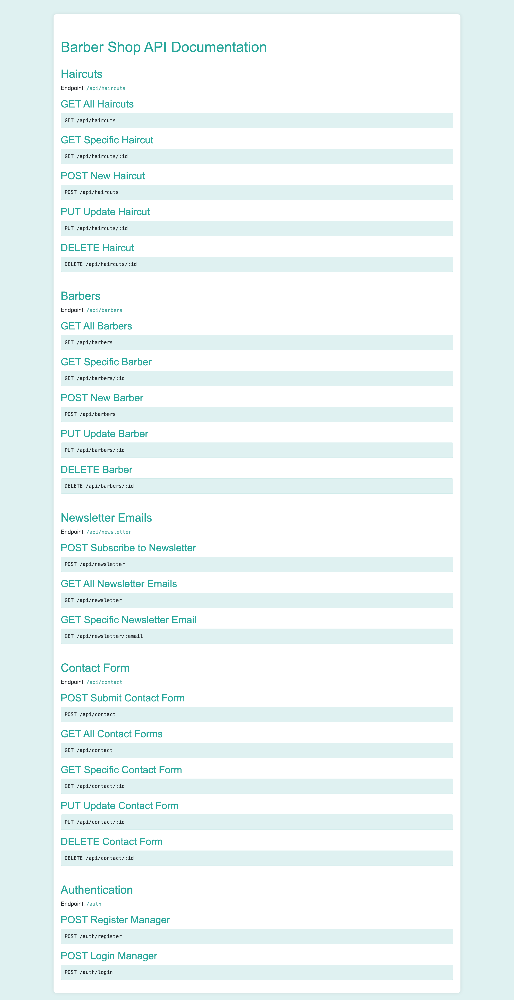

# Barber Shop API


## Description

The Barber Shop API is a back-end application developed for a barbershop. This API offers features to manage haircuts, barbers, newsletter subscriptions, contact forms, and authentication for website managers.

## Technologies Used

- Node.js
- Express.js
- MongoDB (Mongoose for integration)
- JSON Web Token (JWT) for authentication
- Bcrypt for password encryption

## Functionalities

1. **Haircuts:**
    - Register, view, update and delete haircuts.
   
2. **Barbers:**
    - Register, view, update and delete information about barbers.

3. **Newsletter:**
    - Subscribe to the newsletter by providing an email address.
    - View all subscribed emails.
    - View a specific email.

4. **Contact Form:**
    - Send contact form with name, email, subject and message.
    - View all contact forms.
    - View a specific contact form.
    - Update a contact form.
    - Delete a contact form.

5. **Manager Authentication:**
    - Register a new manager.
    - Log in as a manager.

## Installation and Use

1. **Clone the repository:**
    ```bash
    git clone https://github.com/seu-usuario/barber-shop-api.git